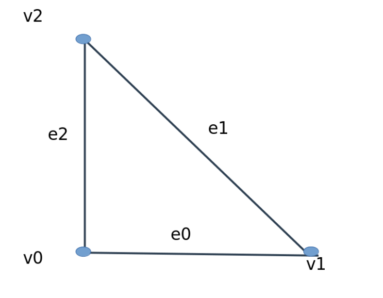
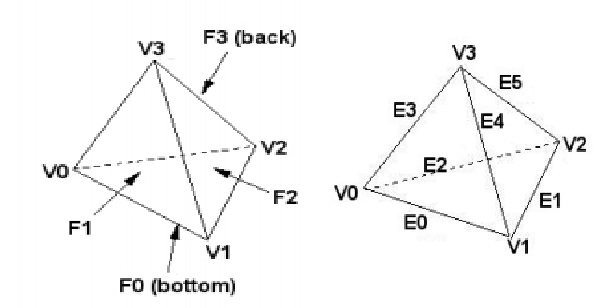
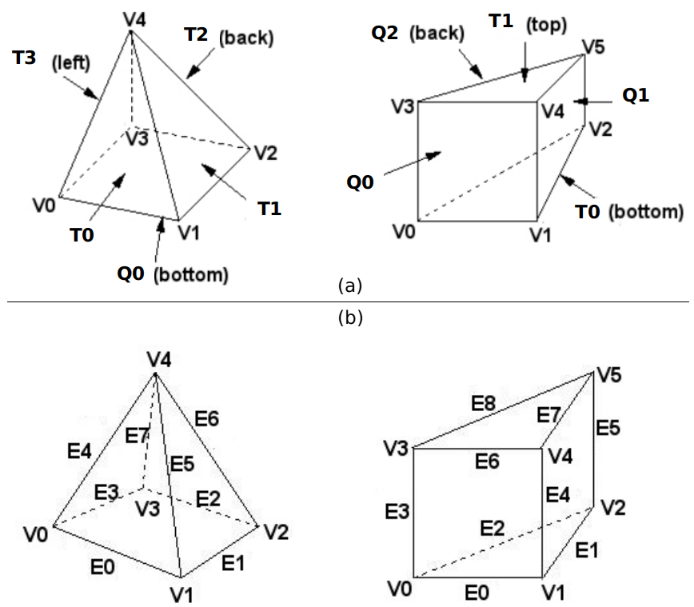

# Adding Shape Functions for Omega_h Element Topologies {#adding-shape-functions-omegah}

This guide walks through every step required to add a new shape function
for an Omega\_h element topology (triangle, tetrahedron, quad, etc.).
The steps are:

1. Define the **shape function struct** in `src/MeshField_Shape.hpp`
2. Define the **Omega\_h node mapping struct** in `src/MeshField.hpp`
3. Register the shape + mapping in the **element factory** in `src/MeshField.hpp`
4. Add an **Accessor** (if needed) and extend **`CreateLagrangeField`** in `src/MeshField_ShapeField.hpp`
5. Add **integration support** in `src/MeshField_Integrate.hpp`
6. (Optional) Write an **`Integrator`-derived class** to perform numerical integration with the new shape.

[TOC]

---

## Background

### Terminology

Refer to the @ref nomenclature "Nomenclature" section on the main page.

### Parametric Coordinates and Node Ordering

MeshFields defines shape functions in a canonical parametric coordinate
system that is independent of Omega\_h.  The **node mapping struct** (Step 2)
bridges the two conventions.

The MeshFields canonical parametric coordinates and node ordering for linear and
quadratic triangles and tetrahedrons follows,
"The Finite Element Method: Its Basis and Fundamentals", 2013,
Zienkiewicz, Taylor, and Zhu.

MeshFields uses \f$d-1\f$ parametric coordinates to specify a location within an
element of dimension \f$d\f$.  The redundant coordinate \f$L_0 = 1 - \sum \xi_i\f$ is
omitted:

| Topology      | Parametric coords | Range           |
|---------------|-------------------|-----------------|
| Edge (1D)     | \f$\xi\f$         | \f$[-1, 1]\f$   |
| Triangle (2D) | \f$(\xi_0,\xi_1)\f$  | \f$[0,1]^2\f$, \f$\xi_0+\xi_1 \le 1\f$ |
| Tet (3D)      | \f$(\xi_0,\xi_1,\xi_2)\f$ | \f$[0,1]^3\f$, \f$\sum \xi_i \le 1\f$ |

---

## Step 1 – Define the Shape Function Struct {#step1}

@ref adding-shape-functions-omegah "Back to top"

Add a new struct to `src/MeshField_Shape.hpp` inside `namespace MeshField`.

### Required Members

| Member | Type | Description |
|--------|------|-------------|
| `numNodes` | `static const size_t` | Total nodes per element |
| `meshEntDim` | `static const size_t` | Parametric space dimension |
| `Order` | `constexpr static size_t` | Polynomial order |
| `DofHolders` | `constexpr static Mesh_Topology[]` | Entity types that hold DOFs |
| `getNodeParametricCoords()` | `KOKKOS_INLINE_FUNCTION` | Flat array of node coordinates (length `numNodes * meshEntDim`) |
| `getValues(xi)` | `KOKKOS_INLINE_FUNCTION` | Shape function values at `xi` (length `numNodes`) |
| `getLocalGradients(xi)` | `KOKKOS_INLINE_FUNCTION` | Gradients at `xi` (length `meshEntDim * numNodes`, row-major: \f$[\partial N_0/\partial\xi_0, \partial N_0/\partial\xi_1, \ldots]\f$) |

Optional (needed by quadratic and higher-order shapes):

| Member | Type | Description |
|--------|------|-------------|
| `NumDofHolders` | `constexpr static size_t[]` | Count of entities of each type in `DofHolders` |
| `DofsPerHolder` | `constexpr static size_t[]` | DOFs per entity for each type in `DofHolders` |

### Validating Parametric Coordinates

Use the helper functions declared at the top of `MeshField_Shape.hpp` to
assert that incoming parametric coordinates are in range.  Pass
`MeshField::ParametricCoordTol` as the tolerance.

```cpp
assert(eachGreaterThanOrEqual(xi, 0.0, ParametricCoordTol));
assert(eachLessThanOrEqual(xi, 1.0, ParametricCoordTol));
// for barycentric remainder:
const Real L0 = 1 - xi[0] - xi[1];
assert(greaterThanOrEqual(L0, 0.0, ParametricCoordTol));
```

### Example: `QuadraticTriangleShape` (from `src/MeshField_Shape.hpp`)

\snippet src/MeshField_Shape.hpp QuadraticTriangleShape

---

## Step 2 – Define the Omega\_h Node Mapping Struct {#step2}
@ref adding-shape-functions-omegah "Back to top"

The mapping struct lives in `src/MeshField.hpp` inside
`namespace MeshField::Omegah`.  It translates element-local node indices
(as numbered by the shape function) into the global mesh entity indices
(as numbered by Omega\_h) that hold the corresponding DOFs.

### Interface Requirements

| Member | Description |
|--------|-------------|
| Constructor `(Omega_h::Mesh &)` | Cache connectivity arrays from Omega\_h; validate mesh family/dimension |
| `static constexpr getTopology()` | Return a `Kokkos::Array<Mesh_Topology, N>` listing element topologies this mapping applies to |
| `operator()(LO nodeIdx, LO compIdx, LO elem, Mesh_Topology topo)` | Return `ElementToDofHolderMap{node, comp, ent, topo}` |

`ElementToDofHolderMap` packs four values: `{nodeLocalIdx, componentIdx, globalEntityIdx, entityTopology}`.

### Omega\_h Connectivity APIs

| Query | API call |
|-------|----------|
| Element→vertex connectivity | `mesh.ask_elem_verts()` → flat `LOs` array, stride = `simplex_degree(elemDim, 0)` |
| Element→edge connectivity   | `mesh.ask_down(elemDim, 1).ab2b` → flat `LOs` array, stride = `simplex_degree(elemDim, 1)` |
| Element→face connectivity   | `mesh.ask_down(elemDim, 2).ab2b` |

### Vertex-Ordering Correction

Omega\_h numbers vertices and edges within a simplex differently from the
MeshFields canonical ordering used by the shape functions.
The existing linear-triangle and linear-tetrahedron mappings correct for
this with a cyclic rotation.

Omega\_h canonical orderings for the supported topologies:

<a href="omegah_tri.png"></a>

<a href="omegah_tetOrdering.png"></a>

<a href="omegah_pyramid_wedge_CanonTemplate.png"></a>

```cpp
// For triangles (triDim=2, vtxDim=0):
const auto localVtxIdx =
    (Omega_h::simplex_down_template(triDim, vtxDim, nodeIdx, /*ignored=*/-1) + 2) % 3;

// For tetrahedra (tetDim=3, vtxDim=0):
const auto localVtxIdx =
    (Omega_h::simplex_down_template(tetDim, vtxDim, nodeIdx, /*ignored=*/-1) + 3) % 4;
```

You must determine the correct rotation offset for your topology by
comparing the Omega\_h canonical vertex/edge ordering (see
`Omega_h_simplex.hpp` and the `simplex_down_template` function) with the
node ordering established by `getNodeParametricCoords()` in your shape
struct.  Validate with a unit test that evaluates the shape functions at
the parametric coordinates of each node and checks that the value for
that node is 1.0 and all others are 0.0.

### Example: `QuadraticTriangleToField` (from `src/MeshField.hpp`)

\snippet src/MeshField.hpp QuadraticTriangleToField

---

## Step 3 – Register in the Element Factory {#step3}
@ref adding-shape-functions-omegah "Back to top"

Add a new factory function (or extend an existing one) in
`src/MeshField.hpp` inside `namespace MeshField::Omegah`.
The existing `getTriangleElement` factory (from `src/MeshField.hpp`) shows the full pattern:

\snippet src/MeshField.hpp getTriangleElement

Callers obtain the shape and mapping via structured bindings:

```cpp
const auto [shp, map] = MeshField::Omegah::getTriangleElement<2>(mesh);
MeshField::FieldElement fes(mesh.nelems(), field, shp, map);
```

---

## Step 4 – Add an Accessor and Extend `CreateLagrangeField` {#step4}
@ref adding-shape-functions-omegah "Back to top"

`src/MeshField_ShapeField.hpp` is the glue between the shape function and the
field storage layer.  The key types are:

**`ShapeField<numComp, Shape, Mixins...>`** — holds the `Shape`, the `MeshInfo`,
and the number of field components.  The `Mixins` are Accessor types that
provide `operator()(entity, node, component, topology)` for reading and writing
DOF values.

\snippet src/MeshField_ShapeField.hpp ShapeField

Two built-in Accessors cover the common cases:

**`LinearAccessor`** — for shapes whose DOFs live only at vertices:

\snippet src/MeshField_ShapeField.hpp LinearAccessor

**`QuadraticAccessor`** — for shapes whose DOFs live at vertices and edges:

\snippet src/MeshField_ShapeField.hpp QuadraticAccessor

If your shape introduces DOFs at a new entity type (e.g., faces), define a new
Accessor following the same pattern and add the corresponding topology to its
`topo` array.

**`CreateLagrangeField<ExecutionSpace, Controller, DataType, order, dim, numComp>(meshInfo)`**
(in `src/MeshField_ShapeField.hpp`) is the user-facing factory that allocates
storage and returns a `FieldWithController<Ctrlr, ShapeField<...>>`.  Add a new
`if constexpr` branch for your shape's order and dimension, constructing the
controller with the right per-entity-type storage sizes and instantiating
`ShapeField<numComp, YourShape, YourAccessor>`.

---

## Step 5 – Add Integration Support {#step5}
@ref adding-shape-functions-omegah "Back to top"

`src/MeshField_Integrate.hpp` provides quadrature rules through the
`getIntegration<Mesh_Topology>()` template function.  To integrate over
your new topology you must:

### 5a – Define an `EntityIntegration` Class

Derive from `EntityIntegration<D>` where `D = meshEntDim` of your shape.
Implement at least one `Integration<D>` inner class that returns a vector
of `IntegrationPoint<D>` objects.  Each point carries:

| Field | Meaning |
|-------|---------|
| `param` | Parametric coordinates (reduced barycentric, length `D`) |
| `weight` | Quadrature weight |
| `dim` | Topological dimension of the entity the point is classified on |
| `idx` | Local entity index within the element |

For the triangle, quadrature weights include the reference area factor
(\f$1/2\f$); for the tetrahedron they include \f$1/6\f$.  Match the
convention used by `TriangleIntegration` and `TetrahedronIntegration`
already in the file.

The existing `TriangleIntegration` (from `src/MeshField_Integrate.hpp`) shows the full pattern including multiple quadrature orders:

\snippet src/MeshField_Integrate.hpp TriangleIntegration

### 5b – Extend `getIntegration<topo>()`

Add a branch to the existing `getIntegration` function (current state in `src/MeshField_Integrate.hpp`):

\snippet src/MeshField_Integrate.hpp getIntegration

---

## Step 6 – Implement an Integrator (Optional) {#step6}
@ref adding-shape-functions-omegah "Back to top"

Derive from `MeshField::Integrator` and override `atPoints` to perform
the actual integration.  `Integrator::process(FieldElement)` handles
quadrature point setup and calls `atPoints` with:

| Argument | Type | Description |
|----------|------|-------------|
| `p` | `Kokkos::View<Real**>` | Local parametric coordinates, shape `(numElems * numPts, dim)` |
| `w` | `Kokkos::View<Real*>` | Quadrature weights, length `numElems * numPts` |
| `dV` | `Kokkos::View<Real*>` | Jacobian determinants, length `numElems * numPts` |

`test/testCountIntegrator.cpp` provides a working example. The integrator class:

\snippet test/testCountIntegrator.cpp CountIntegrator

And the function that wires together the element factory, `FieldElement`, integrator, and `process` call:

\snippet test/testCountIntegrator.cpp doRun

---

## Checklist

- [ ] Shape struct added to `src/MeshField_Shape.hpp` with all required members
- [ ] `getValues` and `getLocalGradients` validated at each node's parametric coords (partition-of-unity and Kronecker-delta checks)
- [ ] Omega\_h mapping struct added to `src/MeshField.hpp`, `namespace MeshField::Omegah`
- [ ] Vertex/edge ordering offset determined and verified against Omega\_h simplex templates
- [ ] Factory function `get<Topology>Element<Order>` added or extended in `src/MeshField.hpp`
- [ ] Accessor defined (if DOFs at new entity types) and `CreateLagrangeField` extended in `src/MeshField_ShapeField.hpp`
- [ ] `EntityIntegration` class added to `src/MeshField_Integrate.hpp`
- [ ] `getIntegration<topo>()` extended for the new topology
- [ ] Test added that constructs a mesh, builds a `FieldElement`, and calls `Integrator::process`
