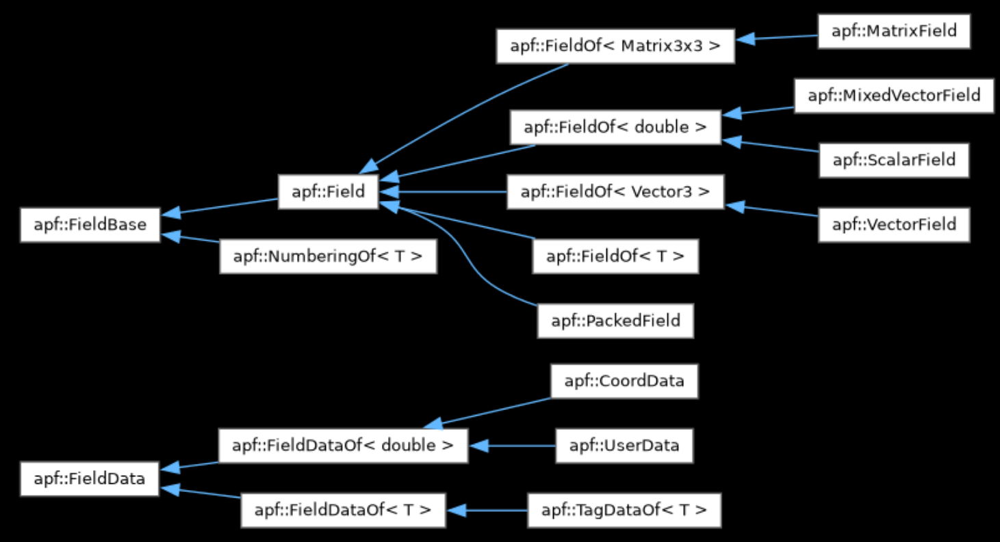
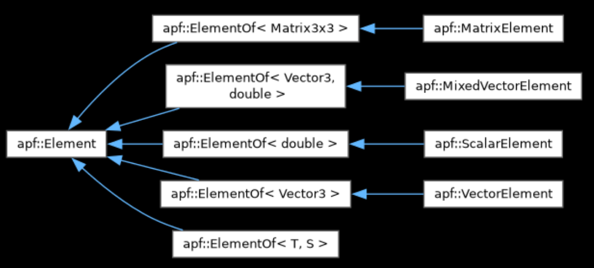

## Table of Contents 

  - [References](#section-id-1)
  - [Design Ideas](#section-id-14)
  - [Implementation notes](#section-id-24)
  - [Questions](#section-id-96)
  - [Terminology](#section-id-146)
  - [Functionality](#section-id-156)
  - [PUMI Fields Review](#section-id-223)
    - [Classes:](#section-id-231)
    - [Field class functions](#section-id-354)
    - [EntityShape class functions - apfShape.h](#section-id-380)
    - [FieldShape class functions - apfShape.h](#section-id-394)
    - [apf::Element class functions - apfElement.h](#section-id-412)
    - [apf::ElementOf class functions - apfElementOf.h](#section-id-421)
    - [apf Integrator Class functions](#section-id-425)
  


<div id='section-id-1'/>

## References

- pumi users guide: https://www.scorec.rpi.edu/pumi/PUMI.pdf
- pumi TOMS paper: https://www.scorec.rpi.edu/REPORTS/2015-4.pdf
- pumi apf source code
- pumi doxygen: https://www.scorec.rpi.edu/pumi/doxygen/
  - with internal headers: https://www.scorec.rpi.edu/~cwsmith/SCOREC/pumiDocs/html/
- pumi apf library documentation: https://github.com/SCOREC/core/blob/bcfbd128b65a629241b629c90e3665b539e2e9ae/apf/apf.tex
- Mark Beall's thesis, Chapter 8: https://scorec.rpi.edu/REPORTS/1999-6.pdf 
  - An object-oriented field API used within the framework ('Trellis') of
    other objects described in the thesis (mesh, model, solution, etc.).
  - Designed to support p-adaptivity (i.e., non-uniform field order)

<div id='section-id-14'/>

## Design Ideas

- don't want dependency on omegah
- have omegah implement the interface outside of meshfields
- pumi APF requires attaching the data to the mesh object
  - omegah supports attached data
  - can the per-entity functions in apf be made callable on the GPU? e.g., call `getValues()` within a kernel
     - no, `getValues` allocates memory for the result via can::NewArray which
       calls the runtime can::Array(n) constructor

<div id='section-id-24'/>

## Implementation notes

- consider using the kokkos reference implementation of mdspan for a backend agnostic type
  - https://github.com/kokkos/mdspan
  - works on GPUs
  - pcms adds memory space compile time checks here:
    https://github.com/SCOREC/pcms/blob/65dd260b902b3e3229a860c94fcdaa83a347cc5a/src/pcms/arrays.h#L15-L20
  - Is a cabana slice (i.e., the object associated with a single type in the parameter pack that stores its values) physically using a contiguous portion of memory?
    - it seems like it: https://github.com/ECP-copa/Cabana/wiki/Core-Slice#raw-data-access-pointers-and-strides
  - **We already have a 'Slice' wrapper interface - does using mdspan instead solve a problem or make our code easier to read/maintain?**

- The controller interface is functionally replacing the Tag mechanism in PUMI
- A FieldData and Field class hierarchies could be created to abstract node/entity operations
- A non-templated Field base class is needed to allow applications to organize
  fields in C++ std:: containers (i.e., vector, map, set, etc.)
  - for that class to not be templated a non-templated FieldData base class is
    needed
  - for now, we'll merge FieldBase and Field - not clear why they are separate
  - ignore the Mesh and FieldShape interfaces for now - we can test a lot of things without it
    - the Mesh interface will require careful consideration
- Is there a better design pattern [2,3] than simple composition, association,
  aggregation, inheritance etc.[1] to define the relationship between Field and FieldData?
  - [1] https://stackoverflow.com/questions/885937/what-is-the-difference-between-association-aggregation-and-composition
  - [2] https://refactoring.guru/design-patterns/cpp
  - [3] Type Erasure. https://www.youtube.com/watch?v=qn6OqefuH08 
- A function will be needed to create a controller with specific storage
  requirements to satisfy a FieldShape definition
  - we'll worry about the return type once we have a clearer picture of the design pattern
  - the following code defines a few structs that provide the needed mesh and
    storage info for implementing `createRealStorage_[kk|cab](...)`
  - extending this to support storing a other types (instead of just 'Real', see the note about 
    'primative data containers' in the #Functionality section) per node may be an interesting next step
```
  struct EntityStorage {
     std::array<bool,4> isEntDimActive; //entDims[i] = true means dimension i needs storage
     int numTriNodes;
     int numQuadNodes;
     int numTetNodes;
     int numHexNodes;
     int numPrismNodes;
     int numPyramidNodes;
  }; 
  struct Mesh {
     int numVtx;    // entDim = 0
     int numEdge;   // entDim = 1
     int numTri;    // entDim = 2
     int numQuad;   // entDim = 2
     int numTet;    // entDim = 3
     int numHex;    // entDim = 3
     int numPrism;  // entDim = 3
     int numPyramid;// entDim = 3
  };
  // the test code should select values of the 
  void createRealStorage_kk(EntityStorage storage, Mesh mesh) {
      // create a kokkos controller that stores an array of 'Real's
      // (double precision floating point) for each entity type (EntType)
      // with size = num<EntType>*num<EntType>Nodes 
      // *if* EntityStorage.isEntDimActive[dim(EntType)] == true
  }
  void createRealStorage_cab(EntityStorage storage) {
      // see createRealStorage_kk, but using cabana controller
  }
```

- A cavity operator could work as follows:
  - user identifies the dimension/order `k` of entities of interest (e.g., vertices, edges, or faces)
  - form the [elements](#elements) for all dimension `d` mesh entities (where `d` is the highest dimension entity in the mesh)
  - query the mesh for the (irregular) list of dimension `d` entities that are adjacent to each dimension `k` entity
  - parallel loop over the dimension `k` entities
    - [parallel] loop over the list of adjacent `d` entities
      - pass the element to the the callback #todo need to check this...

<div id='section-id-96'/>

## Questions

- Do we want/need to support the following features?
  - non-uniform P - no, will require different storage structure
  - polygonal meshes - i.e., wachpress shape functions for seaice - no, will require different storage structure
  - Nedelec shape functions - yes
  - mixed meshes - yes
  - non-conforming - no
- How will these fields interact with mesh adaptation?
  - convert back to mesh library native format?
    - consider defining a field backend that uses flat arrays for easy/clean
      conversion. Christian's serialize/deserialize functions do this.  It may
      be 'better' for these operations to be explicit/exposed.
  - can omegah adapt use these operations for cavity based field transfer
    without invasive changes? Do we define 'cavity' specific field operations?
- Are their fields that require storage of a matrix of values at each dof?
  - yes
- What are the common use cases?
  - for each field:
    - what are the dof holders
    - what is the data type associated with each dof holder
    - what shape functions are associated with the field (they provide metadata query functions)
    - serialize dof holder values for i/o (rendering, communication, etc.)
  - for each mesh entity of a given order/dimension (these are 'Element'
    operations in PUMI terminology):
    - given parametric coords return a value, derivative, shape function evaluation, jacobian evaluation, det jacobian evaluation, jacobian inverse, (maybe hessian)
    - dof values for all dofholders that are part of the element
    - type of base element (tri, quad, tet, wedge, hex, ...)
  - for cavities of mesh entities surrounding a key mesh entity (i.e., a vertex):
    - ...
- What data is needed from the mesh *after* the field is created?
  - should be minimal as field and mesh are immutable
  - need to look at how 'elements' are created
    - this will need to understand local vs global ordering of entities on the
      closure of the 'element'
    - I assume the equivalent set of objects need to be created during field construction
  - pumi uses the meshtag for storage which uses mesh entity storage order for
    access
    - we can simply use local indices for now - may want to abstract this at
      some point
- How will the interface work for integration and cavity operations that need to
  support user defined actions?
  - In PUMI the user implements a derived class (see
    [apf::Integrator](#apf-integrator-class-functions)) and those routines get
    called by a user call to a base class function that loops over all the
    elements and calls the derived class routines.
  - This can be done on GPUs via templates: see the subdirectory `integrationSandbox`
    for implementation of a callback from a `Kokkos::parallel_for` via a functor.
   

<div id='section-id-146'/>

## Terminology

- dof - exists at a dof holder, can be scalar, vector, matrix, etc.
- dof holder
  - can contain a dof
  - possible holder: mesh entities, quadrature points, element centroids, etc.
- node - a location on a mesh entitiy that is a dof holder. Multiple nodes can
         exist per mesh entity.  For example, a mesh edge could have multiple
         nodes for a high order shape function.

<div id='section-id-156'/>

## Functionality

- data types - any POD, don't store everything as a double
- primative data containers that can be stored per dof in a given field
  - scalar (rank 0 tensor)
  - vector (rank 1 tensor)
     - three components 
     - is it general enough to support vectorNd where N={1,2,3}
  - tensor up to rank 4
     - rank N is a 'square' matrix 
       - e.g., a rank 3 matrix is sized dxdxd where d is the extent/size
     - what is the maximum size of each dimension? do we care?
- field
  - requires shape, ownership, and mesh association
  - mesh association will have to encode the type of faces (tri, quad) and
    element (tet, wedge, hex, pyramid)
    - this is sufficient for storage of DG and Nedelec basis functions assuming the same
      basis for each type is used 
  - initially, just focus on simplicies but encode the type explicitly and don't
    assume only one face and element type for a given field
- shape - defines the node distribution where the coordinates and field values (DOF’s) are stored
  - pumi supports the following - each row contains <name, order [, notes]>
    - linear, 1
    - lagrange, {1,2}
    - serendipity, 2
    - constant, 1, constant shape fn over every entity up to dimension 3
    - integration point, {1,2,3}, not clear
    - voroni, ?, not clear - related to integration point field shape
    - integration point fixed, ?, not clear
    - hierarchic, {1,2}
  - do we want to support different orders across a given mesh
    (adaptive/non-uniform p)? - no (see 'non-uniform P' above)
- dof numbering
  - pumi supports this
  - landice needs this
  - the rules/protocol for numbering may not be consistent between applications
- node 
  - get/set nodal values
  - get/set nodal coordinates - why?
  - number of nodes for each mesh entity type
  - etc.
- interogation/math ops
  - add - add a constant (scalar/vector/matrix) to each dof
  - scale - multiply each dof by scalar value
  - evaluate - compute value of field at parametric location within mesh entity
             - see Beall Section 8.2, pg 79 (of 139)
             - **how does this work with the shape function definitions? axpy is part of it IIUC**
- inter-process parallelism - distributed memory across multiple GPUs/CPUs via MPI
  - ownership - which process owns each node, can be defined via 
                function (a protocol) or array of ints (one for each node)
  - synchronize - owner to non-owners
  - accumulate - sum non-owners and owner then synchronize
  - isSynchronized - checks if field is synchronized 
- i/o
  - embed meta data about creation, version, mesh association etc.
  - render - output to vtu - will require mesh topology and shape info
  - write to binary file - supports basic checkpointing
  - write to ascii file
- mesh adaptation
  - support cavity based operators
  - conservative field transfer will require knowing about cavities 
  - unsure what operations will be needed
  - in short term we can convert the field to an omegah tag and let omega manage
    the transfer
  - in longer term we will have to modify omegah (e.g., hooks to call meshField
    APIs from kernels)

<div id='section-id-223'/>

## PUMI Fields Review

Questions:
- how is data stored?  
  - apf::MeshTag (an abstract type that each mesh implements)
- what class has the data? 
  - FieldData (derived class is TagDataOf), which is stored as a pointer from Field

<div id='section-id-231'/>

### Classes:

The heirarchy for the field classes:



FieldBase 
- abstract class
- parent of Field <- FieldOf <- MatrixField, MixedVectorField, ScalarField, VectorField
- parent of NumberingOf
- includes pointer to Mesh, FieldShape, and FieldData
- not templated
- provide meta data functions - counts, types, {set|get}{Data|Shape}, rename, etc.
- no math
- I think this class was an after thought, possibly to support NumberingOf
  - not clear - git history shows FieldBase and Field being added at the same time... the
    change may predate our use of git (or at least the repo)

Field
- abstract class
- parent of FieldOf <- MatrixField, MixedVectorField, ScalarField, VectorField
- parent of PackedField
- not templated
- adds public methods
  - getElement - see below
  - getValueType - scalar, vector, mixedVector (nedelec)
  - project and axpy - PackedField does not support these
- the apf::Mesh stores a vector of Field*

FieldOf
- abstract class
  - does not implement Field::get{Value|Shape}Type
- parent of MatrixField, MixedVectorField, ScalarField, VectorField
- templated on field data type
  - explicitly instantiated in apfFieldOf.cc for Matrix3x3, double, Vector3
- adds {set|get}NodeValue
- implements Field::project and Field::axpy by calling wrapper version defined
  in apfFieldOf.cc

MixedVectorField
- doc string apfMixedVectorElement.h
  > Fields with vector shapes are a bit peculiar, in that
  > the shapes functions are vectors but the dof holders are
  > scalars. Hence the need for this Mixed class. An example of
  > such fields are Nedelec fields.
- used for Nedelec shape functions

{Scalar|Vector|Matrix3x3}Field
- can be instaniated 
- derived from FieldOf<{double|Vector3|Matrix3x3}>
- implements getElement, countComponents, Field::get{Value|Shape}Type

PackedField
- can be instaniated
- contains multiple field values instead of a single double, vector3, etc. in a
  user defined layout that is not known to the class
  - we had a CFD applicaton whose native storage was seven or so doubles per
    mesh vertex that defined velocity (x3), pressure (x1), temperature (x1),
    etc.
  - doc string: 
    > Create a field of N components without a tensor type.
    > Packed fields are used to interface with applications whose fields are 
    > not easily categorized as tensors of order 0,1,2. They contain enough 
    > information to interpolate values in an element and such, but some
    > higher-level functionality is left out.
- implements Field::project and Field::axpy - error if called
- adds private member 'components'
- storage is `double`

FieldData
- abstract class
- parent of FieldDataOf <- CoordData, UserData, TagDataOf
- stores pointer to FieldBase
- pure virtual classes
  - [has|remove]Entity(MeshEntity* )
  - clone, isFrozen, init ...

FieldDataOf
- abstract class
- templated on type (double, int, etc..)
- parent of CoordData, UserData, TagDataOf
- [get/set]NodeComponents
- pure virtual classes
  - get|set(MeshEntity*, T*)

TagDataOf
- child of FieldDataOf
- templated on type (double, int, etc..)
- appears to *mostly* be for internal use during field creation
- contains a TagData object

TagData
- appears to be for internal use only

TagMaker, TagHelper
- helper functions that create MeshTag objects that are the underlying storage
  of fields

EntityShape

FieldShape - from docstring in apfShape.h
- Describes field distribution and shape functions
- typically singletons

Element <div id="elements"/>
- 
- parent of ElementOf
- generic type that appears in most interface functions
- doc string from apf.h
  > A Mesh Element allows queries to the coordinate field,
  > including mapping, differential and total volume, as well as
  > gauss integration point data. A Mesh Element is also required
  > to build a Field Element.

ElementOf
- templated on T and S
  - T is the shape function type (scalar, vector, matrix) and
  - S is the dof holder type
  - for all but MixedVectorElement, T and S are the same
- instantiated to define [Scalar|Vector|Matrix|MixedVector]Element, 
- requires `FieldOf` objects in ctor
  - `FieldOf` is the parent of MatrixField, MixedVectorField, ScalarField, VectorField

<div id='section-id-354'/>

### Field class functions

getElement - creates an 'Element' instance

getValueType - returns integer that maps to
 - Scalar (1 dof/node)
 - Vector (3 dofs/node)
 - Mixed  (??? dofs/node) - the comment in apfField.h is not clear
   
getShapeType - returns integer that maps to 'Regular' or something else; need to look into this

getScalarType - always returns 'Mesh::DOUBLE' - can we modernize this with
                (C++17) type traits (https://www.internalpointers.com/post/quick-primer-type-traits-modern-cpp)

getData - returns instance of 'FieldDataOf<double>'

project(Field* from) - pure virtual, returns void, ?

axpy(double a, Field* from)
 - used in field projection routine
 - constant times a vector plus a vector (see BLAS 'daxpy')
 - apfFieldOf.cc defines class Axpy (derived from FieldOp)
   - inputs:
     - two FieldOf pointers
     - a 'MeshEntity' (this is likely something specific to Fields)

<div id='section-id-380'/>

### EntityShape class functions - apfShape.h

Shape functions over an entity (called 'element' in the code).

Note, nedelec specific functions ommitted.

getValues - evaluate shape function at parametric location within a mesh entity

getLocalGradients - evaluate shape function gradients at parametric location within a mesh entity

countNodes - nodes on the specified entity

alignSharedNodes - convert from shared node order to local/canonical entity order - longer description in code

<div id='section-id-394'/>

### FieldShape class functions - apfShape.h

Describes field distribution and shape functions.  Typically singletons, one for each shape function scheme (lagrange, serendipity, etc.)

Note, nedelec specific functions ommitted. This is a 'vector' based shape function.

getEntityShape - get an EntityShape object for a given entity type (vtx, edge, face, region)

hasNodesIn - check if there are nodes associated with the given entity type

countNodesOn - return the number of nodes associated with the given entity type

getOrder - get polynomial order of shape function scheme

getNodeXi - get the parametric coordinates of a given node for a given entity type

getNodeTangent - get the tangent vector of a node for a given entity type

<div id='section-id-412'/>

### apf::Element class functions - apfElement.h

- getComponents - evaluate field at parametric coordinate 
  - calls apfShape::getValues(...)
  - examples
    - used in `apf::Integrator` derived class implementations
    - spr/sprEstimate[Target]Error.cc
    - test/test_matrix_grad.cc

<div id='section-id-421'/>

### apf::ElementOf class functions - apfElementOf.h

- 

<div id='section-id-425'/>

### apf Integrator Class functions

- apf.h and apfIntegrate.cc
- https://www.scorec.rpi.edu/~cwsmith/SCOREC/pumiDocs/html/classapf_1_1Integrator.html
- defines integration points for up to 7th order tets (`N7`), 2nd order hex, etc..
- callbacks
  - inElement - allow creation of additional element info
  - outElement - destroy additional element info
  - atPoint - called at integration points to accumulate results
  - parallelReduce - called at end of process(mesh) to support distributed memory reduction - used in spr/sprEstimateError.cc
  - process - runs the integrator on an element or all elements in the mesh using callbacks

